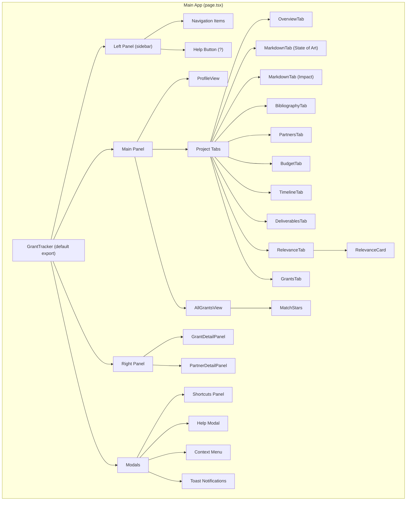
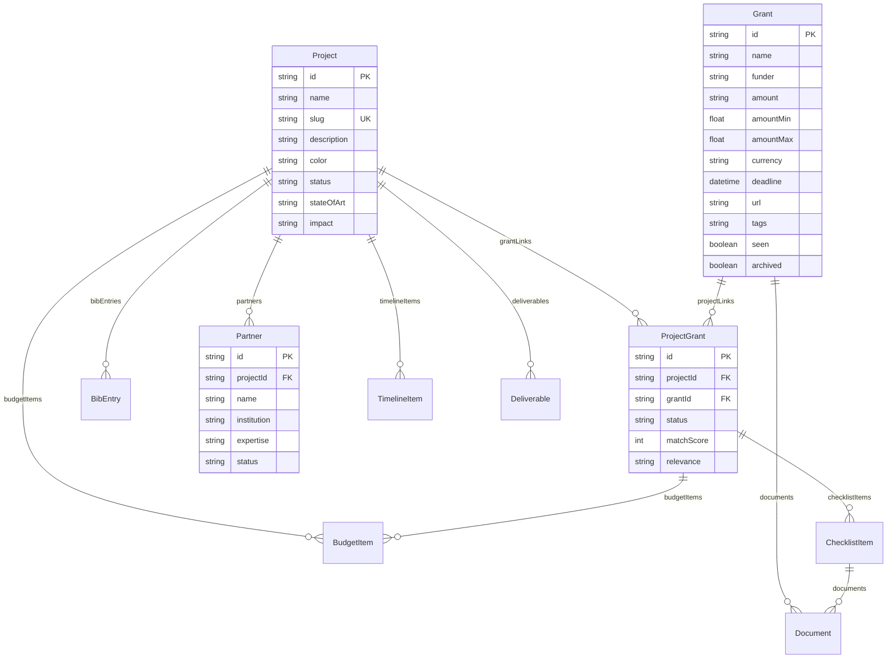

# Grant Tracker — Architecture Reference

> Last updated: 2026-03-17
> For AI agents and developers inheriting this project.

## Tech Stack

| Layer | Technology |
|-------|-----------|
| Framework | Next.js 15 (App Router) |
| Language | TypeScript |
| Database | SQLite via Prisma ORM |
| UI | React (single `page.tsx` SPA) |
| Styling | Vanilla CSS (`globals.css`) |
| Icons | `lucide-react` |
| Markdown | `@uiw/react-md-editor` |
| Port | `localhost:3009` |

## File Structure

```
applications/grant-tracker/
├── prisma/
│   ├── schema.prisma          # Database schema (11 models)
│   └── dev.db                 # SQLite database file
├── src/
│   ├── app/
│   │   ├── page.tsx           # MAIN FILE — all UI components (~1800 lines)
│   │   ├── layout.tsx         # Root layout, meta tags, fonts
│   │   ├── globals.css        # All styles (~600 lines)
│   │   └── api/               # REST API routes (13 resource endpoints)
│   │       ├── projects/      # GET list, POST create, PUT [id], GET [id]
│   │       ├── grants/        # GET list/filter, POST, PUT [id], DELETE all
│   │       ├── project-grants/ # POST link, PUT [id] status/score
│   │       ├── bibliography/  # POST, PUT [id], DELETE [id]
│   │       ├── partners/      # POST, PUT [id], DELETE [id]
│   │       ├── budget/        # POST, PUT [id], DELETE [id]
│   │       ├── timeline/      # POST, PUT [id], DELETE [id]
│   │       ├── deliverables/  # POST, PUT [id], DELETE [id]
│   │       ├── checklist/     # PUT [id]
│   │       ├── profile/       # GET, PUT (singleton)
│   │       ├── papers/        # GET list, GET [filename]
│   │       ├── versions/      # POST (content versioning)
│   │       └── open-finder/   # POST (opens file in macOS Finder)
│   ├── lib/
│   │   ├── prisma.ts          # Prisma client singleton
│   │   └── versioning.ts      # Content version helper
│   └── generated/prisma/      # Auto-generated Prisma client (don't edit)
└── package.json
```

## Component Architecture



## Database Schema (entity-relationship)



## Component Function Index

All components live in `src/app/page.tsx`. Lines are approximate.

### Main Application
| Function | Line | Purpose |
|----------|------|---------|
| `GrantTracker` | ~142 | Root component. State management, routing, sidebar, panels |

### Utility Functions
| Function | Line | Purpose |
|----------|------|---------|
| `pushAction` | ~26 | Undo/redo action stack |
| `deadlineClass` | ~120 | Returns CSS class based on deadline urgency |
| `formatDate` | ~128 | Date → human-readable string |
| `daysUntil` | ~133 | Date → "Xd" remaining countdown |

### Project Tab Components
| Component | Line | Props | Purpose |
|-----------|------|-------|---------|
| `OverviewTab` | ~580 | project, onUpdate, onRefresh | Stats, description editor |
| `MarkdownTab` | ~637 | project, field, label, onUpdate | Reusable MD editor (State of Art, Impact) |
| `BibliographyTab` | ~681 | project, onRefresh | Add/list bibliography entries |
| `PartnersTab` | ~881 | project, onRefresh, selectedPartner, onSelectPartner | Add/list partners, clickable cards |
| `BudgetTab` | ~1053 | project, onRefresh | Budget line items by category |
| `TimelineTab` | ~1122 | project, onRefresh | Milestones and deadlines |
| `DeliverablesTab` | ~1182 | project, onRefresh | Work packages and deliverables |
| `RelevanceTab` | ~1245 | project, onRefresh | Per-grant relevance notes |
| `RelevanceCard` | ~1268 | pg, onSave | Editable relevance text per grant |
| `GrantsTab` | ~1282 | project, selectedGrant, onSelectGrant, onRefresh, onContextMenu | Project-scoped grant list |

### Global Views
| Component | Line | Props | Purpose |
|-----------|------|-------|---------|
| `AllGrantsView` | ~1374 | selectedGrant, onSelectGrant | Global grant list with filters, tags, delete-all |
| `ProfileView` | ~1652 | (none) | User profile editor (6 sections) |

### Panels & Widgets
| Component | Line | Props | Purpose |
|-----------|------|-------|---------|
| `GrantDetailPanel` | ~1557 | pg, onRefresh | Right panel with full grant details, checklist, docs |
| `PartnerDetailPanel` | ~963 | partner, onRefresh, onUpdate | Right panel with partner details, view/edit |
| `MatchStars` | ~1538 | score, pgId, onRefresh | Interactive 1-5 star relevance rating |

## API Routes Map

All routes follow Next.js App Router conventions (`route.ts` files).

| Method | Endpoint | Purpose |
|--------|----------|---------|
| GET | `/api/projects` | List all projects with relations |
| POST | `/api/projects` | Create project |
| GET | `/api/projects/[id]` | Get project with all relations |
| PUT | `/api/projects/[id]` | Update project fields |
| GET | `/api/grants` | List grants (filterable: `?tag=`, `?funder=`, `?archived=`) |
| POST | `/api/grants` | Create grant |
| DELETE | `/api/grants` | Delete ALL grants (prototyping) |
| GET | `/api/grants/[id]` | Get single grant |
| PUT | `/api/grants/[id]` | Update grant fields |
| POST | `/api/project-grants` | Link grant to project |
| PUT | `/api/project-grants/[id]` | Update link status/matchScore |
| GET | `/api/profile` | Get user profile |
| PUT | `/api/profile` | Update user profile |
| POST | `/api/bibliography` | Add bib entry |
| PUT | `/api/bibliography/[id]` | Update bib entry |
| DELETE | `/api/bibliography/[id]` | Delete bib entry |
| POST | `/api/partners` | Add partner |
| PUT | `/api/partners/[id]` | Update partner |
| DELETE | `/api/partners/[id]` | Delete partner |
| POST | `/api/budget` | Add budget item |
| PUT | `/api/budget/[id]` | Update budget item |
| DELETE | `/api/budget/[id]` | Delete budget item |
| POST | `/api/timeline` | Add timeline item |
| POST | `/api/deliverables` | Add deliverable |
| POST | `/api/versions` | Save content version (undo history) |
| POST | `/api/open-finder` | Open file in macOS Finder |

## Key State in GrantTracker

| State | Type | Purpose |
|-------|------|---------|
| `projects` | Project[] | All projects from API |
| `selectedProjectId` | string | Currently selected project |
| `globalGrantsMode` | boolean | Showing "All Grants" view |
| `profileMode` | boolean | Showing user profile |
| `selectedGrant` | ProjectGrantLink | Grant open in right panel |
| `selectedPartner` | Partner | Partner open in right panel |
| `contextMenu` | {x, y, pg} | Right-click context menu state |
| `showShortcuts` | boolean | Keyboard shortcuts modal |
| `showHelp` | boolean | Help documentation modal |
| `activeTab` | string | Current project tab (Overview, Grants, etc.) |

## Antigravity AI Skill Files

```
.agents/
├── workflows/
│   └── search-grants.md       # 10-phase grant search workflow
├── data/
│   ├── GRANT_SOURCES.md       # 30 funding database registry
│   └── grant-search-runs.log.md  # Run history
└── scripts/
    └── scrapers/
        ├── eflux_scraper.py   # e-flux announcements (HTML-based)
        └── onthemove_scraper.py  # On The Move funding (HTML-based)
```

## Conventions for Future Development

1. **All UI in `page.tsx`** — single-file SPA pattern. Extract to separate files if grows past ~2500 lines.
2. **API routes** follow REST conventions: `route.ts` for collection, `[id]/route.ts` for individual.
3. **Prisma** — run `npx prisma db push` after schema changes, then `npx prisma generate`.
4. **Grants** — created with `seen: false` → glowing NEW badge. Set `seen: true` when user clicks.
5. **Tags** — comma-separated string field, not a relation. Filter client-side.
6. **MarkdownTab** — reusable for any project text field (stateOfArt, impact, or add more).
7. **Right panel** — shows either `GrantDetailPanel` or `PartnerDetailPanel`, controlled by parent state.
8. **Context menu** — right-click on grant rows for archive/remove/mark-as-new actions.
